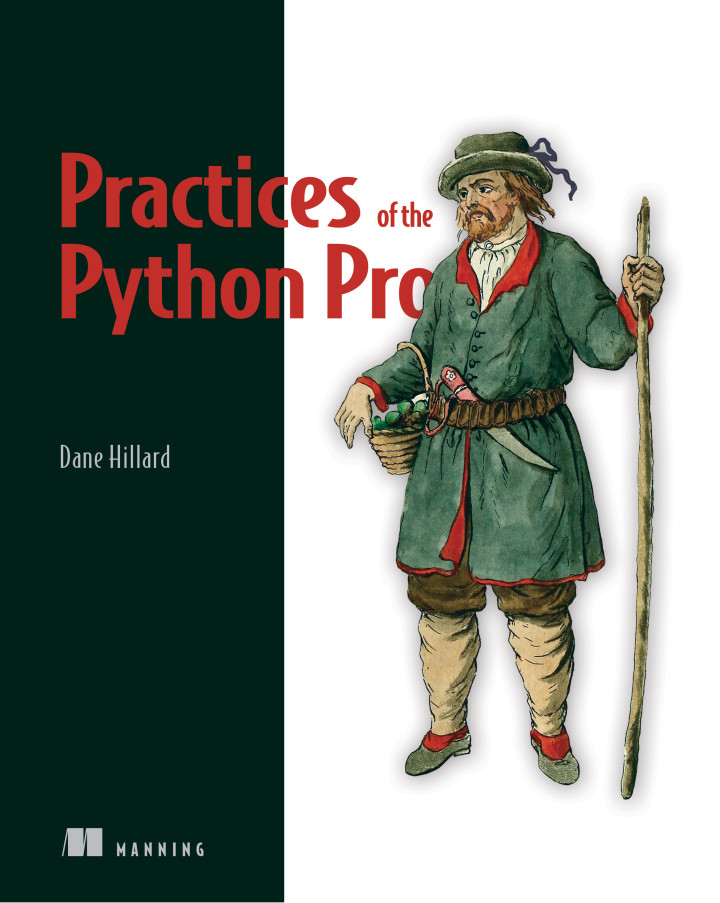

# Exercises for Practices of the Python Pro 🐍📘

This repository contains the source code for the examples and exercises contained in [Practices of the Python Pro](https://bit.ly/the-python-pro).
The repository is a template repository, so if you'd like to follow along with the book you can [make your own copy](https://github.com/daneah/practices-of-the-python-pro/generate).

Each chapter's examples are in their own directory.
In some chapters, you'll find multiple snippets in a single module.
These won't always produce output when you run them, and are occasionally meant only as snippets to demonstrate a concept.
In later chapters, some modules act as an entrypoint to run a program from the command line, importing other modules along the way.
Follow along in the book for more context!

## Notes
### Ch 2. Separation of concerns
- When a class depends on another class, those classes are said to be coupled. If a class depends on many details of another class, such that changing one requires changing the other, those classes are tightly coupled.
- We want our classes to have high cohesion because if everything in a class is closely related, our concerns are likely to be well separated. When a class’s methods and attributes are closely related, it is said to have high cohesion.
- The process of breaking a problem into small, manageable pieces is called decomposition.
- If a function becomes too long or does too many things, it can be difficult to characterize and therefore difficult to name.
- Clear code requires you to keep less knowledge in your head at any given time
- Separation of concerns is a major key to understandable code; many design concepts arise directly from this principle
- Functions extract named concepts from procedural code. Clarity and separation are the primary objectives of extraction; reuse is a secondary benefit.
- Classes group closely related behaviors and data together into an object
- Modules group related classes, functions, and data while keeping independent concerns separate. Explicitly importing code from other modules makes it clear what's being used where.
- Packages help create a hierarchy of modules that helps with naming and code discovery.

### Ch 3. Abstraction and encapsulation
- Abstraction is a tool for deferring obligatory comprehension of code.
- Abstraction takes many forms: decomposition, encapsulation, programming style, and inheritance versus composition.
    - Decomposition is the separation of something into its constituent components
    - Encapsulation groups related functions and data into a larger construct.
    - Programming styles: procedural, functional, declarative
    - Composition frees you from the limitations of a hierarchy while still providing the concept of relatedness between two things
- Each approach to abstraction is useful, but context and extent of use are important considerations.
- Refactoring is an iterative process; abstraction that once worked may need to be revisited later.

### Ch 4. Designing for high performance
- Design for performance both up front and iteratively throughout your development.
- *Time complexity* is a measure of how quickly your code can perform a task in relation to its inputs
- *Space complexity* is a measure of how your code uses disk space or memory as its inputs grow.
- The ideal complexity is constant time (O(1)), which doesn’t depend on the size of the inputs
- It’s useful to examine the worst case to get a better sense for what the code is capable of. Big O notation always measures the worst-case complexity of code for this reason.
- Think carefully about the right data type for the task.
- Prefer generators over lists when you don’t need all the values at once, to save on memory usage.
- Use the timeit and cProfile/profile Python modules to test your hypotheses about complexity and performance.

### Ch 5. Testing your software
- Functional tests make sure code produces the expected output from a given input.
- Testing saves you time in the long run by catching bugs and making refactoring code easier.
- Manual testing isn’t scalable and should be used to supplement automated testing.
- Unittest and pytest are two popular unit and integration testing frameworks for Python.
- Test-driven development puts the tests first, guiding you to a working implementation based on the requirements.

### Ch 6. Separation of concerns in practice
- Separation of concerns is a tool for achieving more readable, maintainable code.
- End-user applications are often separated into persistence, business logic, and presentation layers.
- Separation of concerns works closely with encapsulation, abstraction, and loose coupling.
- Applying effective separation of concerns allows you to add, change, and delete functionality without affecting the surrounding code.

### Ch 7. Extensibility and flexibility
- Code is said to be *extensible* if adding new behaviors to it has little or no impact on existing behaviors.
- The mapping of choices to messages acts like configuration—information a program uses to determine how to execute. Configuration is often easier to understand than conditional logic.
- Deep nesting is a strong hint that concerns need further separation.
- if/elif/else are difficult to reason about
- *Inversion of control* says that instead of creating instances of dependencies in your class, you can pass in existing instances for the class to make use of. The control of dependency creation is inverted by giving the control to whatever code is creating.
- Making testing easier is one of the big reasons to follow the principles you’ve learned in this book. If your code is hard to test, it may be hard to understand as well. If it’s easy to test, it may be easy to understand. Neither is certain, but they’re correlated.
- This practice of sharing agreed-upon interfaces (in contrast with class-specific details) between high- and low-level code will give you the freedom to swap implementations in and out.
- *Entropy* is the tendency for organization to dissolve into disorganization over time. Code often starts out small, neat, and understandable, but it tends toward complexity over time.
- Build code so that adding new features means adding new functions, methods, or classes without editing existing ones.
- Inversion of control allows other code to customize behavior to its needs without changing the low-level implementation.
- Sharing agreed-upon interfaces between classes instead of giving them detailed knowledge about each other reduces coupling.
- Be deliberate about what input types you want to handle, and be strict about your output types.

### Ch 8. The rules (and exceptions) of inheritance
- _Parent_ classes are referred to as superclasses in Python (and in many other languages). Child classes are referred to as subclasses.
- A class inherits all of its superclass’s information and behavior, and it can then override them to do something different. This is probably the tightest coupling that exists in programming. A class is fully coupled to its superclass because everything it knows and does by default is tied to that superclass.
- Inheritance is for specialization of behavior.
- Ideal use case for inheritance
    1. Shallow, narrow hierarchy: makes it easer to reason about. Narrow means there shouldn't be too many subclasses.
    2. Subclasses are at the leaves of the object graph; they don't make use of other objects. If a subclass has a unique dependency that the superclass or any other subclasses don’t have, composition might be a better way to accomplish that portion of the task.
    3. Subclasses use (or specialize) all the behavior of their superclass
- The latest versions of Python support type hinting, which is a way to tell developers and automated tooling what types of objects a function or method expects
- Python also supports the idea of multiple inheritance, where a subclass may have two or more direct superclasses
- You can see the method resolution order for any class by using its __mro__ attribute:
- Abstract base classes in Python are a way of using something that looks like inheritance to achieve something that’s effectively an interface. An abstract base class, like a formal interface in other languages, outlines which methods and attributes its subclasses must implement. Python provides the abc module for easing the creation of abstract base classes
- Use inheritance to represent true is-a relationships (good for specialization of behavior).
- Use composition for has-a relationships (good for reuse of code).
- Method resolution order is key to keeping multiple inheritance straight.
- Abstract base classes provide interface-like control and safety in Python.

### Ch 9. Keeping things lightweight
- Measuring *cyclomatic complexity* involves determining the number of execution paths through a function or method
- Most sources recommend shooting for a complexity of 10 or lower for a given function or method. This corresponds roughly to how much developers can reasonably understand at once.
- Untested branches of execution are usually what people are referring to when they talk about “edge cases,” a term with negative connotations that usually means “a thing we didn’t think of.
- *Halstead complexity* attempts to measure quantitatively the ideas of level of abstraction, maintainability, and defect rate. Measuring Halstead complexity involves inspecting a program’s use of the programming language’s built-in operators and how many variables and expressions it contains
- Radon (https://radon.readthedocs.io) can measure the Halstead complexity of your Python programs if you’re interested in exploring.
- Extracting configuration into a map also makes code much more readable, in my experience. Trying to sift through a number of if/elif conditions is tiresome, even when they’re all fairly similar. In contrast, a dictionary’s keys are generally scannable.
- Complexity example: each of these functions has a cyclomatic complexity of 1, is quite readable, and has a nice separation of concerns
- When you find that a class starts growing in complexity, it’s usually due to a mixing of concerns. Once you identify a concern that feels like its own object, you’ve got enough to start breaking it down.
- Getters and setters are generally discouraged in Python because they can clutter up a class.
- The @property decorator can be used to signify that a method on a class should be accessible as an attribute. Methods can be used as properties only if self is their only argument, because when you access the attribute, you can’t pass any arguments to it.
- Backward compatibility is the practice of evolving your software without breaking the implementation consumers previously relied on.
- You can continue accepting calls in one class and pass them along to another class under the hood. This is known as forwarding.
- When several methods in a class share a common prefix or suffix, especially one that doesn’t match the name of the class, there might be a new class waiting to be extracted
- Code complexity and separate concerns are better metrics than physical size for breaking up code.
- Cyclomatic complexity measures the number of execution paths through your code.
- Extract configuration, functions, methods, and classes freely to break down complexity.
- Use forwarding and deprecation warnings to temporarily support the new and old ways of doing things.

### Ch 10. Achieving loose coupling
- Loose coupling is what allows you to make changes in different areas of your code without worrying that you’ll break something elsewhere
- Coupling between two pieces of code (modules, classes, and so on) is considered tight when those pieces of code are interconnected. Anytime a class, method, or function needs to carry a lot of knowledge about another module or class, that’s tight coupling
- In general, tight coupling is problematic when it exists between two separate concerns. Some tight coupling is a sign of high cohesion that isn’t structured well.
- You can effectively identify coupling by assessing the likelihood that any given change to a module will require a change to the code that uses it.
- Loose coupling is the ability of two pieces of code to interact to accomplish a task without either relying heavily on the details of the other. This is often achieved through the use of shared abstractions.
- Loosely coupled code implements and uses interfaces; at the extreme end, it uses only interfaces for intercommunication.
-  When code performs several tasks using mainly features from another area, that code is said to have *feature envy*.
- Feature envy can be solved the same way you fixed your query-cleaning logic: roll it up into a single entry point back at the source.
- A *leaky abstraction* is one that doesn’t sufficiently hide its details. The abstraction claims to provide a simple way to get something done, but it ultimately requires you to have some knowledge about what lies beneath when using it.
- Leaks happen because there’s a trade-off to consider with abstractions—generally speaking, the further you abstract a concept in code, the less customization you can provide
- When you find yourself providing access to a low-level detail from a high-level layer of abstraction, you’re likely introducing coupling.
- Just as you reduced each of your commands to an execute interface that returns a status and result to decouple them from the presentation layer, you can reduce your persistence layer to a more general set of CRUD operations to decouple it from the commands.
- Separate concerns, encapsulate data and behaviors, and then create shared abstractions to loosen coupling.
- Classes that know and use many details of another class may need to be subsumed by that class.
- Tight coupling can be addressed by re-encapsulation with stronger cohesion, but it can often be well-served by the introduction of a new abstraction shared by both parties. (For example, a menu and a command may rely on the command returning a status and a result instead of specific messaging.)

### Ch 11. Onward and upward
- A mind map organizes information in a hierarchical structure you can explore visually
- By using a mind map to enumerate things you want to learn about, you can build up a pretty good picture of different areas you’ll need to cover.
- A common pitfall is to do a deep dive into one topic without enough context about the rest of the bigger picture, so make sure you maintain a balance. Too much focus in one spot too soon can lead you to solidify an inaccurate or incomplete understanding that can inhibit future learning.
- There are a few distinct states in learning about a particular topic:
    1. *Want or need to learn*— It’s on your list of topics to cover, but you haven’t started on it yet.
    2. *Actively learning*— You’ve explored and read some resources on the topic, and you’re looking for more.
    3. *Familiar*— You understand the topic generally, and you have some idea how you might apply it.
    4. *Comfortable*— You’ve applied the concepts from this topic a few times and have a handle on it.
    5. *Proficient*— You’ve applied the concepts enough to know some of the nuances, and you know which resources to reach for when you     encounter new kinds of problems.
- A number of design patterns are creational ones. Python’s dynamic typing frees it from many of these limitations, so many creational patterns simply aren’t necessary in Python.
- **Design patterns Terms**
    1. Creational design patterns
    2. Factories
    3. Behavioral design patterns
    4. Command pattern
    5. Structural design patterns
    6. Adapter pattern
- **Distributed Systems Terms**
    1. Distributed systems
    2. Fault tolerance
    3. Eventual consistency
    4. Desired state
    5. Concurrency
    6. Message queueing
- Tools like Black (https://github.com/psf/black) take python style suggestions a step further, imposing a deterministic, opinionated formatting to all your code.
- **Pythonic Code Terms**
    1. Pythonic code
    2. Pythonic way to do X
    3. Idiomatic Python
    4. Python anti-patterns
    5. Python linters
- Learning is not a passive process. Make a plan that works for you, write it down or map it out, and track your progress. This can generate more ideas or next steps to help keep you motivated and curious.
- Try to identify common patterns and approaches to problems. As you encounter those same problems, try a few different approaches early on to see which work most smoothly. Patterns are tools, and they should enhance your work rather than hinder it.    
- Feel at home in your language. You don’t need to pick it up all at once, but keep a curious mindset and ask often if there’s a more idiomatic way to express a thought in code.

## Errata and questions

If you find an error in the code or the book, or if you have a question about the content, please read the [contribution guidelines](.github/CONTRIBUTING.md) to understand the best course of action.
The errata are published on [the book's homepage](https://bit.ly/the-python-pro).
